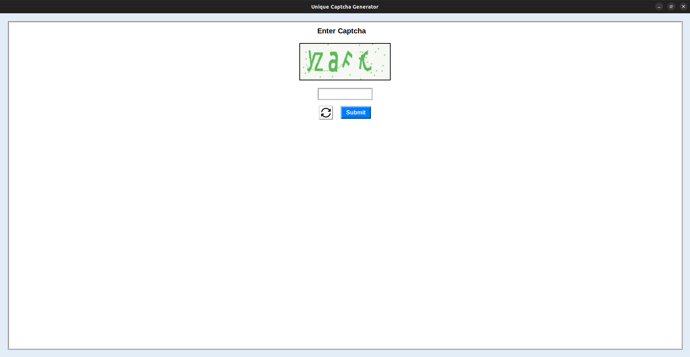
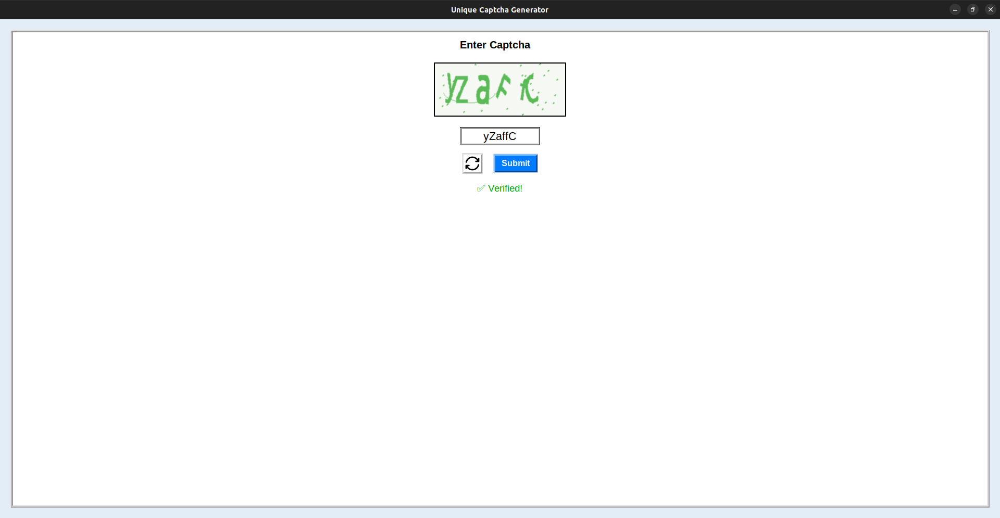
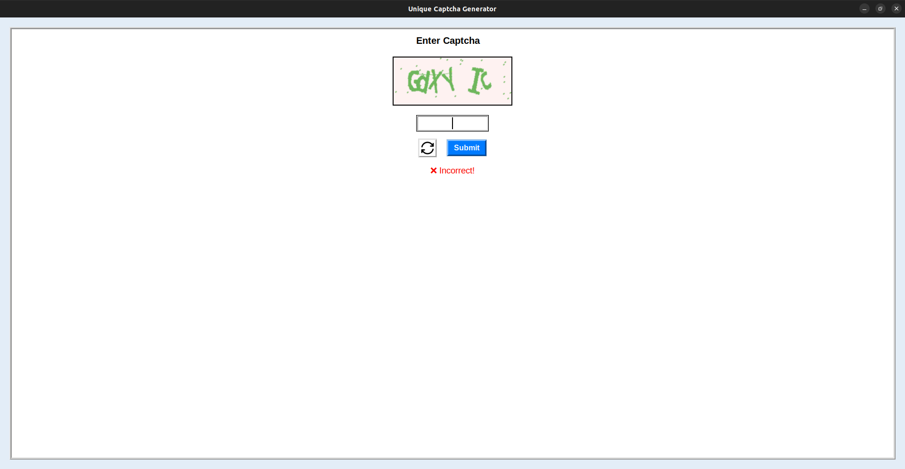

# Captcha Crafter

Captcha Crafter is a simple yet effective **image-based CAPTCHA generator** built using **Python** and **Tkinter**. It generates random alphanumeric CAPTCHAs and provides a user-friendly GUI for verification. The project is designed with a modern, sleek UI for better user experience.

## Features

✅ **Random CAPTCHA Generation** – Alphanumeric CAPTCHAs generated dynamically.  
✅ **Customizable Design** – A unique, modern UI with glassmorphism effects.  
✅ **Real-Time Verification** – Instantly checks if the user input matches the generated CAPTCHA.  
✅ **Refresh Button** – Allows users to reload the CAPTCHA if needed.  
✅ **Simple & Lightweight** – Built using Python with minimal dependencies.

## Installation

1. **Clone the Repository**:
   ```bash
   git clone https://github.com/yourusername/CaptchaCrafter.git
   cd CaptchaCrafter
   ```

2. **Install Required Dependencies**:
   ```bash
   pip install -r requirements.txt
   ```

3. **Run the Application**:
   ```bash
   python generatecaptcha.py
   ```


## Usage

1. Run the script.
2. A CAPTCHA image will be displayed.
3. Enter the text shown in the image.
4. Click the **Submit** button to verify.
5. If incorrect, a new CAPTCHA will be generated automatically.
6. Click the **Refresh** button to reload the CAPTCHA manually.

## Refresh Icon

If the **refresh.png** icon is missing, you can create one using [Flaticon](https://www.flaticon.com/) or use the following Python code:

```python
from PIL import Image, ImageDraw

size = (32, 32)
img = Image.new("RGBA", size, (255, 255, 255, 0))
draw = ImageDraw.Draw(img)
draw.arc([2, 2, 30, 30], start=30, end=330, fill="black", width=3)
draw.polygon([(22, 6), (26, 2), (28, 10)], fill="black")
img.save("refresh.png")
```

## Screenshots





## License

This project is **open-source** under the **MIT License**.

## Contributing

Pull requests are welcome! If you'd like to improve the UI or add features, feel free to contribute.

---
Enjoy using **Captcha Crafter**! 🚀